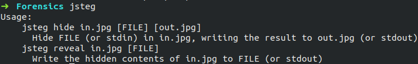

## Tools

### Jsteg

#### Introduction

Jsteg is a package for hiding data inside jpeg files, a technique known as [steganography](https://en.wikipedia.org/wiki/Steganography). This is accomplished by copying each bit of the data into the least-significant bits of the image. The amount of data that can be hidden depends on the filesize of the jpeg; it takes about 10-14 bytes of jpeg to store each byte of the hidden data.

#### Installation

```
$ sudo wget -O /usr/bin/jsteg https://github.com/lukechampine/jsteg/releases/download/v0.1.0/jsteg-linux-amd64
$ sudo chmod +x /usr/bin/jsteg
$ sudo wget -O /usr/bin/slink https://github.com/lukechampine/jsteg/releases/download/v0.2.0/slink-linux-amd64
$ chmod +x /usr/bin/slink
```

#### Usage

Jsteg tool can be initialised by typing the following command.
```
$ jsteg
```



##### Hiding data

Now, lets hide some data using jsteg.
Consider this image of Itachi.


Let the name of file to be embedded be 'jsteg.txt'.

The file to be embedded contains the following data.


Commands to embed a file in the JPEG image is as follows.
```
$ jsteg hide <in.jpg> <secret file name> <out.jpg>
```


Now, the image looks like this.


##### Revealing data

The syntax for revealing data is as follows.
```
$ jsteg reveal <in.jpg> <output file name>
```


#### Reference

For further reference , click [here](https://godoc.org/github.com/lukechampine/jsteg).
